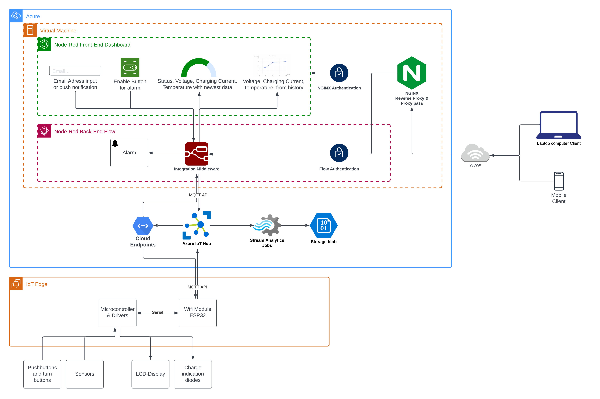
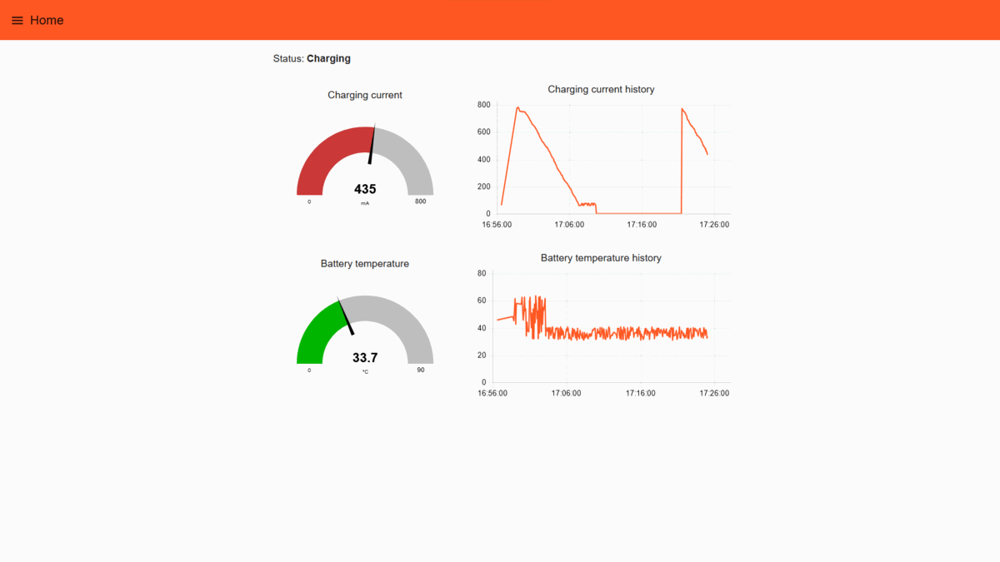

# Tillämpad A/D-Teknik
Kod och instruktioner för Atmel 644P, ESP32, Azure IoT Hub, Node-RED och NGINX

Av detta material kan projektets mikrokontrollerprogram och IoT arkitekturen återskapas, samt ritnigar över hårdvaran presenteras.

### Slutlig kod:
- ESP32: [Utvecklat för Arduino IDE](./prod_code/ESP32/)
- ATmega644p: [Utvecklat för Microchip Studios](./prod_code/ATmega644p/)
- Node-RED: [JSON format](./prod_code/Node-RED/)

### Delar av koden som använts under utveckling:

- ESP32: [Exempel från programbibliotek](./examples/ESP32/)
- ESP32: [Utvecklad källkod](./src/ESP32/)
- ATmega644p: [Utvecklad källkod](./src/ATmega644p)

## IoT-arkitekturen

I IoT arkitekturen körs Node-RED virtuellt i Azure. Node-RED fungerar både som presentationsskikt (frontend) och dataåtkomstskiktet (backend) för mjukvaran. Frontend är lösenordskyddad med hjälp av NGINX. Dataåtkomstskiktet (backend) kommunicerar inte direkt med någon hårdvara utan data som fåtts har skickats över MQTT med hjälp av Azure IoT Hub som är en molnbaserad IoT plattform, inklusive en MQTT broker. Azure IoT Hub får data från enheten ESP32 (IoT edge) som använder programbiblioteket Azure_SDK_for_C för att kommunicera.

Data som skickas fås ursprungligen från en ATmega644p där ADC omvandling och övervakningen sker. Detta data sänds då till ESP32:n som den då processerar och sänder vidare till molnet.  

Läs mer om de olika modulerna som bygger upp IoT arkitekturen:

- [Azure IoT hub](./instructions/Azure_IoT_Hub.md) (i molnet)
- [ESP32](./instructions/ESP32.md)
- [NGINX](./instructions/NGINX.md)
- [Node-RED](./instructions/Node-RED.md)

### Node-RED dashboard

## Hårdvara

- [Elschema](./instructions/pdf/ESP32_elschema.pdf)
- [Visuell presentation](https://robwiklund.github.io/A-D_teknik/)