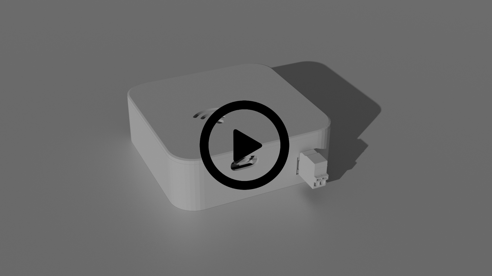

# Tillämpad A/D-Teknik
Kod och instruktioner för Atmel 644P, ESP32, Azure IoT Hub, Node-RED och NGINX

Av detta material kan projektets mikrokontrollerprogram samt IoT arkitekturen återskapas.

### IoT-arkitekturen

### Node-RED dashboard

### Video ESP32 skal prototyp

